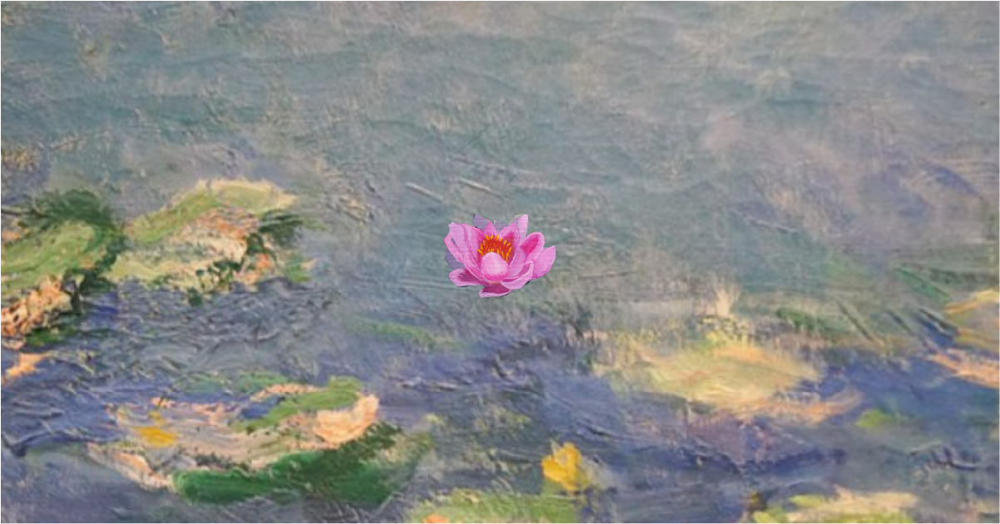

# Reflections of Monet

## Description

**Reflections of Monet** is an interactive web art experience that reimagines Monet’s _Water Lilies_, translating its physical beauty into a dynamic fusion of light, movement, and sound.

## Features

- **Immersive visual reinterpretation** of Monet’s iconic masterpiece, bringing it to life through interactive elements.
- **Scrolling-based depth simulation**, where scrolling downward mimics submerging underwater, and scrolling upward represents resurfacing.
- **Nature-inspired audio design**, blending **water elements, ripples, and ambient nature sounds** to enhance the immersive experience.
- **Dynamic light and movement**, capturing the essence of Impressionist techniques in a digital format.
